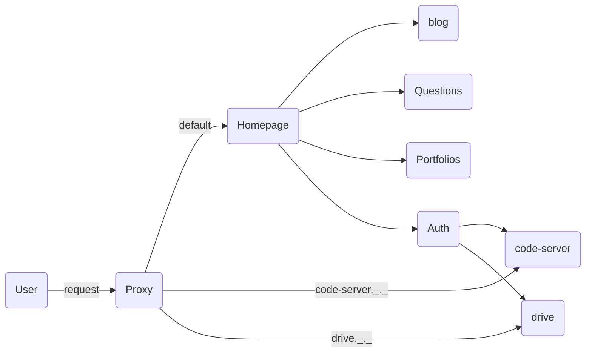

## 1. 서론
그냥 홈페이지가 갖고 싶었다.  
마침 노트북 한 대가 남아서 여기 우분투 서버를 깔아서 돌려보도록 하자. 

## 2. 본론
일단 caffeineoverdose.life라는 도메인을 [호스팅케이알](https://www.hosting.kr/)에서 구입했다.  
뭔가 컨셉을 운동하는 전산과 학생 뭐 이런걸로 잡고 싶은데 운동이랑 전산학이랑 공통점이 카페인을 때려넣어야 내가 작동한다는 것 같아서 골라봤다.  
그냥 .com이나 깔쌈한걸 쓰고 싶었지만 .life가 특가처럼 엄청 싸게 풀려있길래 1년만 구매하고 연장 안해야겠다는 생각으로 일단 구매했다.  
근데 생각보다 *.life* 이거도 멋진거 같고 좋은거같기도 하다.  

여기 홈페이지를 띄울텐데 추후 이런저런 인공지능 모델 같은거도 서비스하고 싶은 야망이 있는 관계로 Django 베이스로 띄우기로 결정했다.  
내가 원하는 기능은 아래와 같다.
1. 디자인에는 영 아닌 관계로 최대한 컴팩트하게
2. 포트폴리오를 띄울 수 있도록 갤러리 형식으로 볼 수 있는 화면이 있으면 좋겠다
3. 나에게 하고 싶은 말을 하거나 서로 소통할 수 있는 창도 있으면 좋겠다
4. 나중에 무슨 기능이 추가될지 모르니 로그인/회원가입 등 유저 관리 기능이 있으면 좋겠다
5. 지금은 github.io로 호스팅하지만 aws에 올리고 ssl 인증서 발급이 가능해지면 이 블로그도 해당 서버에서 서비스할 예정이다.
    - 지금 이 블로그는 Jekyll로 돌리고 있는데 _site 파일만 갖고온다고 django에서 서비스가 될지는 잘 모르겠다...
    - [이 글](https://www.ajnisbet.com/blog/jekyll-in-django)을 보고 용기를 얻었는데 잘 모르겠다..
6. 화면이 너무 비어보일까봐 걱정이라 [BuyMeACoffee](https://www.buymeacoffee.com/sjh354) 링크도 넣기로 했다
  

여기에 추가로 생각해 본 점들은 아래와 같다
- 여기에 노트북이 오래되기도 했고, 관리 등 여러 문제를 생각했을 때 AWS EC2에 올릴 예정인데, 이때를 대비해 docker 이미지로 갖고 있을 필요가 있겠다.
- code-server.caffeineoverdose.life에서는 온라인 IDE를 구성해서 쓸 예정이다.
- drive.caffeineoverdose.life에서 드라이브 같이 파일 공유할 수 있는 서비스도 개발알 예정이다.

생각 나는건 많은데 일단 홈페이지 메뉴에는 Blog, Questions, Portfolio, BuyCoffee, Login/Logout 메뉴만 띄우고 새로 서비스 생기는건 Portfolio에서 a 링크로 걸어주는게 깔끔할 것 같다.
  

일단 대충 그림으로 정리해보면 다음과 같다. (여기 내가 쓴 [Chirpy](https://github.com/cotes2020/jekyll-theme-chirpy)라는 템플릿에서 [mermaid](https://github.com/mermaid-js/mermaid)라는걸 쓸 수 있길래 써봤다)

뭔가 난잡한데 그렇게 되어버렸다.ㅋㅋ  
일단 django에서 제공하는 Auth를 사용해서 question같은건 먼저 구현해보고 나중에 따로 이걸 위한 DB를 구축해야겠다.  
 

그리고 메인 페이지에 들어갈 기깔나는 표지를 그리고 싶었는데 쉽지 않았다. 
인공지능한테 대충 헬스하는 개발자 느낌으로 그려달라 했는데 아래를 얻었다. 

그럭저럭 나쁘지 않은 것 같기도 하고..? 
그래서 이 블로그도 싹다 저 사진으로 도배했다. 
살다보면 쓸만한 이미지가 생기지 않을까 생각하기로 했다.

## 3. 결론

대충 아웃라인은 잡힌 것 같다  
이제 고생을 좀 해봐야겠다 으악

